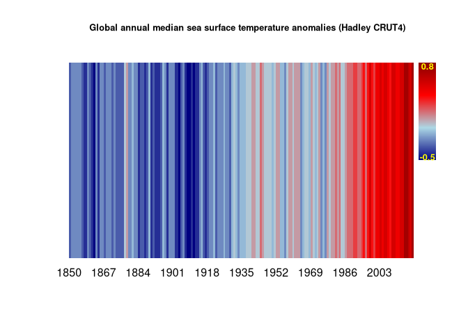
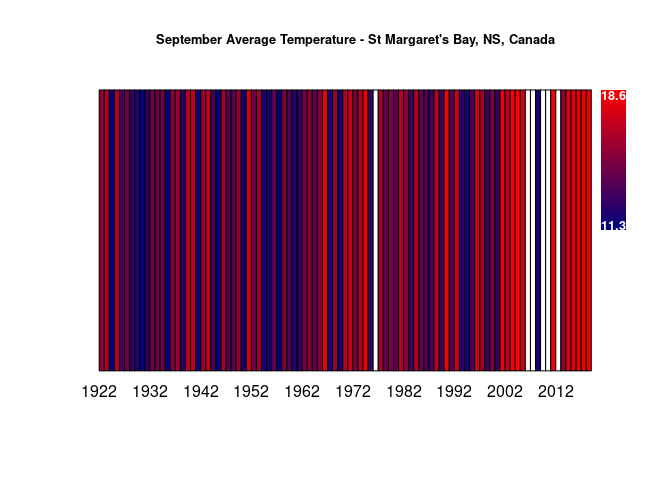

### What are Climate Stripes?

Climate stripes are visualisations of climate change from a temperature
time series (Climate Lab 2018). They are meant mostly as a communication
tool to a lay public and can be grasped almost instantly. They were
developed to have minimal annotation almost like a colour bar code.
Legend and time axis options have been included here if one wants to
convey a bit more information.

Installation
------------

    library(devtools)
    install_github("duplisea/climatestripes")

    library(climatestripes)

Make climate stripe plots for data downloaded from NASA’s GISS Surface Temperature Analysis
-------------------------------------------------------------------------------------------

Suface air temperature data was downloaded for St Margaret’s Bay, Nova
Scotia, Canada to use as an example.

    temperature.vector= stmargaretsbay$metANN
    # set the missing value code (999.9) to NA
    temperature.vector[temperature.vector==999.9]=NA
    time.vector= stmargaretsbay$YEAR

    climate.col.stripes.f(time.vector= time.vector,temperature.vector= temperature.vector,
      col1="blue", col2="red",
      title="Annual Average Temperature - St Margaret's Bay, NS, Canada",
      legend=T,
      legend.text.col="white")

This clearly shows a warming particularly since the early 1980s. There
is a cooling from the mid 1990s to early 2000s and then the temperature
increases in the second decade of the 2000s which includes the warmest
years on record. The legend shows that the warmest year was 8.6 °C while
the coldest was 4.1 °C. Years without data are shown without colour.

Make a climate stripe plot for just one month from the GISS dataset
-------------------------------------------------------------------

    temperature.vector= stmargaretsbay$SEP
    temperature.vector[temperature.vector==999.9]=NA
    time.vector= stmargaretsbay$YEAR
    climate.col.stripes.f(time.vector= time.vector,temperature.vector= temperature.vector,
      col1="blue", col2="red",
      title="September Average Temperature - St Margaret's Bay, NS, Canada",
      legend=T,
      legend.text.col="white")

An annual climate stripe image with one plot for each month of the year
-----------------------------------------------------------------------

    months=c("JAN","FEB","MAR","APR","MAY","JUN","JUL","AUG","SEP","OCT","NOV","DEC")
    monthcols= match(months,names(stmargaretsbay))
    time.vector= stmargaretsbay$YEAR
    par(mfcol=c(6,2),mar=c(.2,.1,.5,.1))
    for (i in monthcols){
      temperature.vector= stmargaretsbay[,i]
      temperature.vector[temperature.vector==999.9]=NA
      climate.col.stripes.f(time.vector= time.vector,temperature.vector, title=months[i-1], time.scale=F,legend.text.col="white")
    }

The axis has been omitted to bring out the general pattern and
comparison between months. The legends give an idea of the actual
temperature each month.

References
==========

Climate Lab. 2018.
<a href="https://www.climate-lab-book.ac.uk/2018/warming-stripes/" class="uri">https://www.climate-lab-book.ac.uk/2018/warming-stripes/</a>

GISTEMP Team, 2019: GISS Surface Temperature Analysis (GISTEMP), version
4. NASA Goddard Institute for Space Studies. Dataset accessed 2019-06-20
at
<a href="https://data.giss.nasa.gov/gistemp/" class="uri">https://data.giss.nasa.gov/gistemp/</a>.

Lenssen, N., G. Schmidt, J. Hansen, M. Menne,A. Persin,R. Ruedy, and D.
Zyss, 2019: Improvements in the GISTEMP uncertainty model. J. Geophys.
Res. Atmos.
<a href="doi:10.1029/2018JD029522" class="uri">doi:10.1029/2018JD029522</a>.
